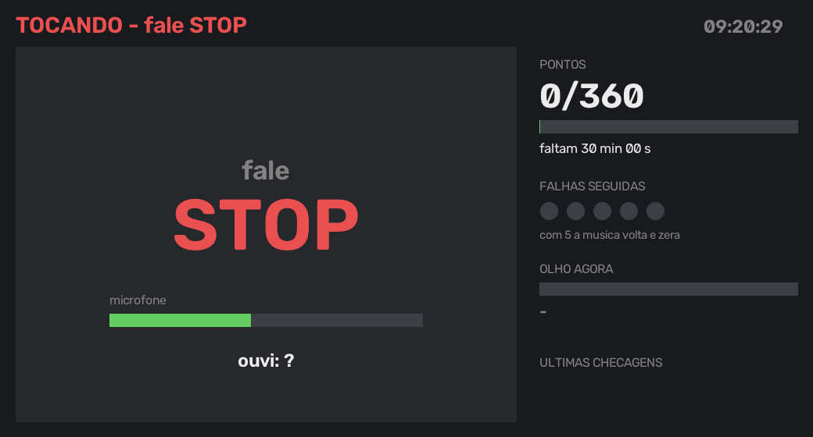
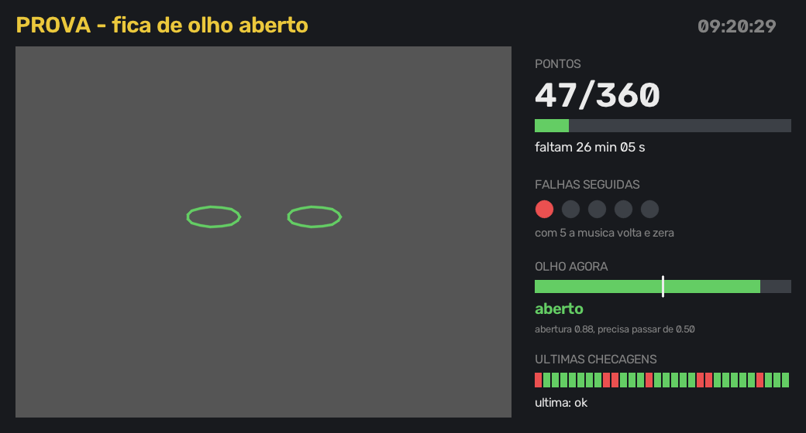
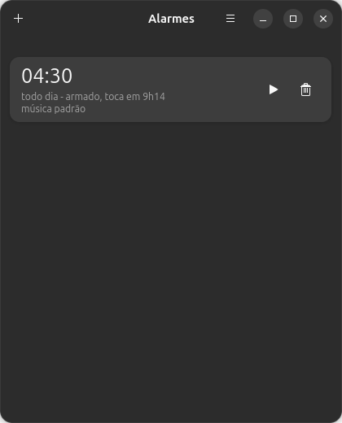
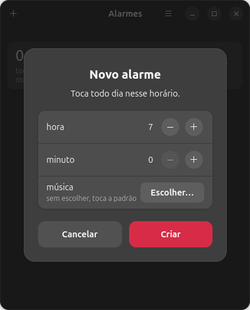

# wakeup

Meu despertador. Toca todo dia na hora que eu marcar no app, e não deixa
eu voltar a dormir.

Antes eu tinha um `.sh` que só tocava um mp3. Funcionava até o dia em que eu
aprendi a apertar mute e voltar pra cama. Esse aqui não deixa.

Roda no Linux Mint (Cinnamon) e no Ubuntu 26.04 (GNOME). O que muda entre os
dois está em [Mint x Ubuntu](#mint-x-ubuntu).

## O que ele faz

Toca a música até eu falar **"stop"**. Aí a webcam tem que me ver **de olho
aberto** por 1 hora. Se eu sumir ou cochilar 5 checagens seguidas, os
pontos zeram e a música volta do começo.

Da **terceira falha seguida** em diante entra a sirene, e ela piora a cada
falha. Conta tanto "sem rosto" quanto "olho fechado", e acertar uma checagem
zera e cala na hora:

| falhas | som |
|--------|-----|
| 3 | bip curto e baixo a cada 1,2s — só pra me cutucar |
| 4 | bip duplo, onda quadrada, bem mais alto |
| 5 | sirene subindo de 700 a 2200 Hz, quase sem pausa, no volume máximo |

Enquanto a sirene apita, o som é forçado pro alto-falante igual na música:
fone esquecido plugado não salva. Mas **só enquanto ela apita**. Quando a
música volta, quando eu acerto uma checagem ou quando eu mato o alarme, o
volume, o mudo e o perfil da placa voltam exatamente como estavam antes — o
alarme guarda isso antes de encostar.

Fora música e sirene, ele não toca no áudio. Com a cara sendo reconhecida e
nada tocando, a hora de prova é minha: dá pra ouvir o que eu quiser, no
volume que eu quiser.

Cinco threads:

- **guardiao** — enquanto a música ou a sirene tocam, a cada 1s desmuta,
  põe o volume em 70% (100% na sirene nível 5), joga o som pro alto-falante
  do notebook e sobe outro `mpv` se eu matar o processo.
- **anti_shadow** — brilho da tela no máximo o alarme inteiro.
- **olheiro** — lê a webcam a 30fps e guarda só o frame mais novo.
- **vitrine** — mantém o painel aberto (abaixo).
- **berro** — a sirene das falhas (`sirene.py`).

O olheiro é o que mais deu trabalho. O V4L2 enfileira tudo: depois de 5s
parado tinha 2000+ frames na fila, e o atraso crescia a cada ciclo — eu punha
a cara na frente e nada acontecia, porque ele estava julgando imagem de
minutos atrás. Ler numa thread separada da detecção resolveu.

Câmera que não abre (tela trancada) conta como falha e a música volta. É de
propósito: se eu não logar, não desarmo.

## O painel

Uma janela (`painel.py`) que abre sozinha quando o alarme começa:

- a câmera espelhada, com o contorno dos olhos **verde** (aberto) ou
  **vermelho** (fechado), e "SEM ROSTO" quando eu saio do quadro;
- a barra de abertura do olho agora, com a linha do limite do `OLHO`;
- pontos, quanto falta, falhas seguidas (5 bolinhas), o nível da sirene
  quando ela liga, e as últimas 30 checagens;
- na fase da música, "fale STOP", o nível do microfone e o que ele ouviu.





Na segunda o retângulo cinza é onde entra a câmera: é um render pra conferir
o layout, com olhos desenhados no lugar dos meus.

É um processo separado que só lê o que o `wakeup.py` publica em
`$XDG_RUNTIME_DIR/wakeup/` (`estado.json` e o frame mais novo). Não abre
câmera nem microfone. Se ele travar ou eu fechar a janela, o alarme nem sente
— e ela volta em 2s.

Quem decide ponto e falha continua sendo o `wakeup.py`. O painel mede o olho
de novo só pra mostrar ao vivo.

Rodando pelo systemd o alarme não está na sessão gráfica, então o `DISPLAY` e
o `XAUTHORITY` vêm de `systemctl --user show-environment` (o GNOME preenche no
login). O Qt que vem no pip do opencv só tem o plugin `xcb`, então a janela
abre pelo Xwayland. Antes do login não tem display e ele fica tentando.

`PAINEL=0 ./main.sh` roda sem janela.

## A agenda (os alarmes)

Os alarmes ficam num app GTK, o `agenda.py` — "Alarmes" no menu do GNOME.
Por enquanto ele faz o essencial: criar e apagar, só o horário, tocando todo
dia.





O caminho de um alarme:

```
agenda.py  →  ~/.config/wakeup/alarmes.json  →  wakeup-sync.path (root)
           →  wakeup-sync  →  /etc/systemd/system/wakeup@0600.timer
           →  wakeup@0600.service  →  main.sh
```

O app só escreve o json. Quem transforma isso em timer é o `wakeup-sync`,
que roda como root porque **`WakeSystem=true` só funciona em unit de
sistema** — timer de usuário não tem permissão de armar o RTC
(`CAP_WAKE_ALARM`), e sem isso o note suspenso não acorda.

Criar alarme não pede senha porque o `wakeup-sync.path` fica vigiando o json
e chama o sincronizador sozinho. O preço disso é que um arquivo que meu
usuário escreve manda num processo root, então:

- o `wakeup-sync` mora em `/usr/local/sbin/`, não aqui na home — senão
  bastaria editar este arquivo pra rodar como root;
- nada do json vira texto de unit. O único dado aproveitado é a hora, e só
  depois de casar com `HH:MM`. O resto do unit é fixo no código.

Como eu já tenho sudo nessa máquina, isso não é escalada de privilégio de
verdade, é só não deixar porta aberta à toa.

Instalar (idempotente, pode rodar de novo depois de um `git pull`):

```
sudo ./instalar.sh
```

Ele põe o sincronizador no lugar, escreve os units com o meu usuário e o
caminho do repo, e remove os units antigos. O primeiro alarme herda a hora do
`alarm.timer` antigo, ou nasce 06:00 numa máquina nova.

Detalhes que valem o comentário:

- `AccuracySec=1s` nos timers. Sem isso o default é 1 minuto, e o alarme
  disparava uns 8s atrasado.
- `Persistent=no`: alarme perdido não dispara atrasado no boot.
- `flock` no `main.sh`: com dois alarmes perto um do outro, o segundo sai na
  hora em vez de subir outro `mpv` por cima do primeiro.

Falta (na ordem que eu quero): dias da semana, música e duração por alarme,
botão de testar/parar no app, soneca.

## Rodando

```
./setup.sh              # deps + modelos
./calibra.py            # limiar de olho aberto pra minha cara
ALVO=3 ./main.sh        # teste rápido: 3 checagens em vez de 720
./sirene.py 5           # ouvir um nível da sirene na mão (esse é o pior)
sudo ./instalar.sh      # agenda + units (ver "A agenda")
```

`VOLUME` também dá pra trocar, mas cuidado: o volume do PipeWire é cúbico.
`VOLUME=15%` dá -49 dB no alto-falante do note — não se ouve nada. Pra teste
mais baixo, uns 40%.

Pra testar a prova sem falar nem acordar ninguém: `ESCUTAR=0` pula o "stop"
e cai direto na câmera, `SIRENE=0` deixa a sirene muda (o nível continua
aparecendo no log) e `OLHO=0` faz toda checagem falhar, que é como eu vejo a
escalada inteira em 10s.

O repo tem que ficar em `~/.local/wakeup`: é o caminho que o `instalar.sh`
grava no `ExecStart` dos units.

Pra desligar quando der errado: `sudo systemctl stop wakeup@0530` (o número
é a hora do alarme sem os dois-pontos), ou Ctrl+C se rodou na mão. Os dois
calam a sirene e devolvem o som pro fone antes de sair. Não tem `Restart=` no
service justamente pra isso.

### Testar

Com tudo já configurado, o teste rápido na mão — **toca alto**, 5 checagens
de 3s em vez de 720 de 5s:

```
cd ~/.local/wakeup && ALVO=5 INTERVALO=3 ./main.sh
```

Falo "stop", encaro a câmera até fechar os 5 pontos. Pra ouvir a sirene, é só
desviar o olho uns 10s no meio: na terceira falha ela liga e sobe de nível a
cada falha seguinte.

Do jeito que ele roda de verdade, pelo systemd (aí é 1 hora de prova):

```
sudo systemctl start wakeup@0530
sudo systemctl stop wakeup@0530      # o botão de pânico
```

E só a sirene, sem alarme nenhum: `./sirene.py 3`, `4` ou `5`.

## Mint x Ubuntu

|                    | Linux Mint (Cinnamon 6.6)           | Ubuntu 26.04 (GNOME, Wayland)            |
|--------------------|-------------------------------------|------------------------------------------|
| Tampa              | `gsettings` do Cinnamon             | `logind.conf.d` + reboot                 |
| Fone x alto-falante| um sink, duas portas                | dois perfis da placa                     |
| `pactl`            | já vinha                            | `pulseaudio-utils`                       |
| Microfone          | já vinha                            | `libportaudio2`                          |
| Python             | 3.12                                | 3.14 (as deps têm wheel)                 |

### A tampa do notebook (sem isso nada funciona)

Eu durmo com o note fechado. Se fechar a tampa suspende, o alarme não toca —
o `WakeSystem=true` até acorda a máquina, mas ela volta a dormir.

**Mint (Cinnamon 6.6):**

```
gsettings set org.cinnamon.settings-daemon.plugins.power lid-close-ac-action nothing
gsettings set org.cinnamon.settings-daemon.plugins.power lid-close-battery-action nothing
gsettings set org.cinnamon.settings-daemon.plugins.power inhibit-lid-switch true
```

Detalhe que descobri conferindo o meu: o `logind.conf` lá está vazio, então
o default é `suspend` — quem segura a tampa é só o `csd-power` do Cinnamon,
via inhibitor lock. Dá pra ver quem está segurando com:

```
systemd-inhibit --list | grep lid
```

Se um dia eu trocar de desktop ou a sessão do Cinnamon cair, a tampa volta a
suspender e o despertador morre junto. O `logind.conf` abaixo é o cinto de
segurança, e vale no Mint também.

**Ubuntu (GNOME):** o schema `org.gnome.settings-daemon.plugins.power` tem as
mesmas chaves, mas o GNOME novo ignora e quem manda é o systemd. Então é o
logind, num drop-in pra não mexer no arquivo do pacote:

```
sudo mkdir -p /etc/systemd/logind.conf.d
printf '[Login]\nHandleLidSwitch=ignore\nHandleLidSwitchExternalPower=ignore\n' \
  | sudo tee /etc/systemd/logind.conf.d/wakeup.conf
```

**E reiniciar.** O logind só lê isso quando sobe; `systemctl restart
systemd-logind` derruba a sessão gráfica. Pra conferir que pegou (tem que
dar `"ignore"`):

```
busctl get-property org.freedesktop.login1 /org/freedesktop/login1 \
  org.freedesktop.login1.Manager HandleLidSwitch
```

Caí nessa: escrevi o arquivo, não reiniciei, e o logind rodando continuava
em `suspend`.

### Fone plugado x alto-falante

O `wakeup.py` acha o alto-falante sozinho pelo nome da porta
(`ALTO_FALANTE = "Speaker"`) e cobre os dois jeitos que a placa tem de
esconder ele:

- **Mint:** um sink só (`...HiFi__hw_sofhdadsp__sink`) com as portas
  `[Out] Speaker` e `[Out] Headphones`. Fone plugado troca a porta; o
  guardião troca de volta com `pactl set-sink-port`.
- **Ubuntu:** cada saída é um sink, e fone e alto-falante são **perfis
  diferentes da placa**: `HiFi (HDMI1, HDMI2, HDMI3, Headphones, Mic1, Mic2)`
  e `HiFi (HDMI1, HDMI2, HDMI3, Mic1, Mic2, Speaker)`. Com o fone plugado o
  sink `...HiFi__Speaker__sink` **não existe** — por isso o nome fixo que
  funcionava no Mint mandava o som pro fone sem dar erro. O guardião troca
  o perfil com `pactl set-card-profile`, e devolve perfil, volume e mudo
  quando a música para e a sirene cala (no "stop", no Ctrl+C e no
  `systemctl stop`).

Se mesmo no perfil certo não sair som com o fone plugado, olhar o auto-mute
do codec — ligado, ele corta o alto-falante por hardware:

```
amixer -c 0 sget 'Auto-Mute Mode'   # aqui: Disabled
```

O `pactl -f json` é chamado com `LC_ALL=C`: com locale pt ele solta acento
no json e quebra o parse.

## Mudei de máquina ou de distro

Antes de formatar: salvar o `sons/alarm.mp3`. Ele não está no repo e o
`setup.sh` não baixa. O resto (`model/`, `face_landmarker.task`, `.venv/`)
o setup rebaixa sozinho.

Clonar em `~/.local/wakeup`. O `instalar.sh` já resolve usuário, UID e
caminho do repo sozinho; o que continua preso na máquina antiga é só um:

```
which uv  # caminho no main.sh
```

Instalar o que não costuma vir:

```
sudo apt install mpv                                   # Mint
sudo apt install mpv pulseaudio-utils libportaudio2    # Ubuntu
```

Mais o `uv`, e depois `./setup.sh`, `./calibra.py`, `sudo ./instalar.sh` e a
tampa (ver [Mint x Ubuntu](#mint-x-ubuntu)).

## Notas

- O mp3 não está no repo. Põe o teu em `sons/alarm.mp3`.
- Se a tua placa chamar o alto-falante de outro nome, `pactl list sinks`
  mostra o nome da porta; troca o `ALTO_FALANTE` no `wakeup.py`.
- Os níveis da sirene (frequência, duração, pausa e amplitude) estão numa
  tabela só, no topo do `sirene.py`.
